# システムの使い方

## 1.フォーム作成

新規をクリックします。
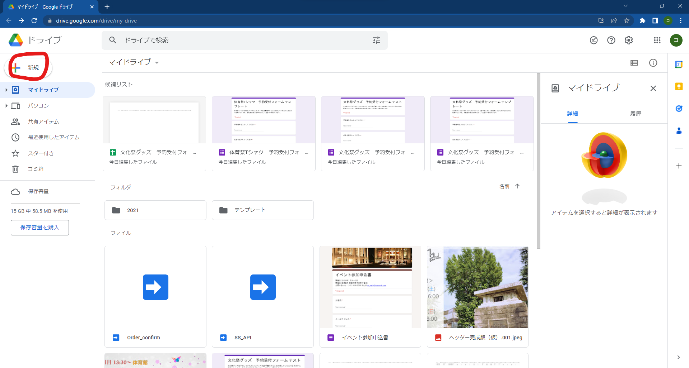

新しいフォルダをクリックします。
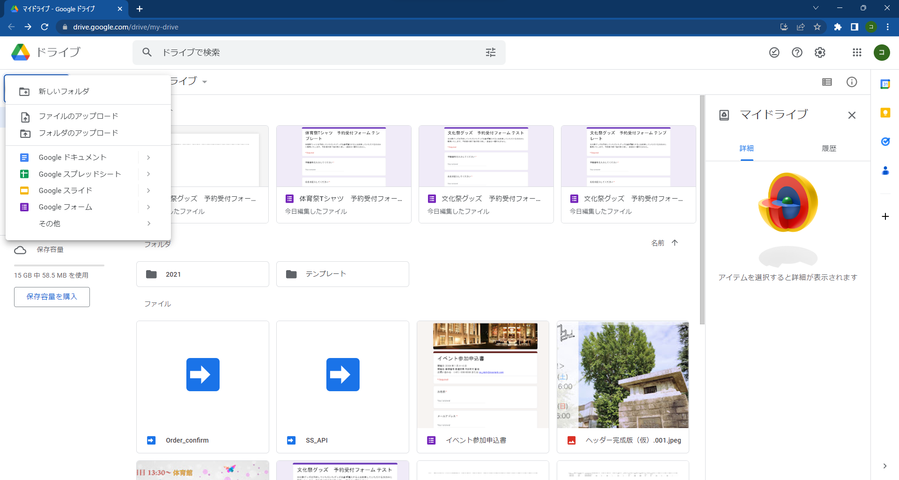

名前を変更して作成します。
おすすめは年度です。
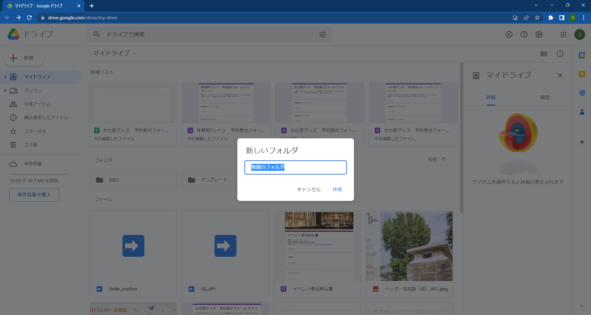
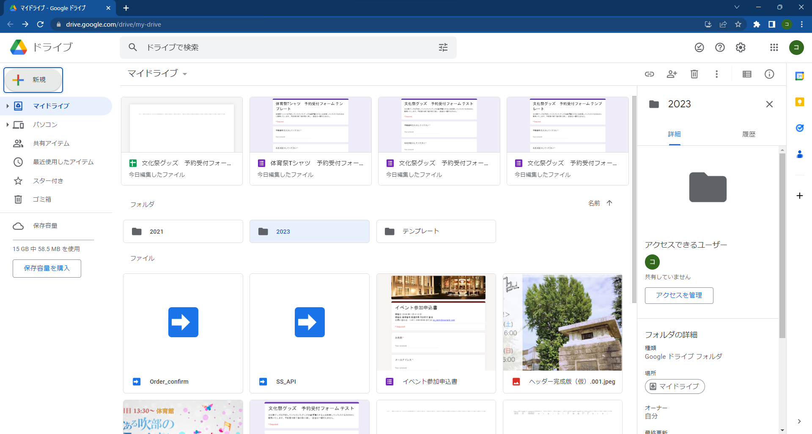

作成したフォルダに入ります。(今回は2023)
同様にして「体実」フォルダを作ります。

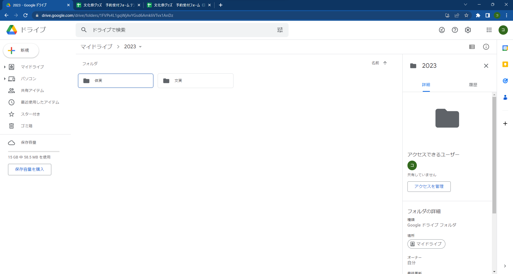

マイドライブまで戻り、テンプレートに入ります。
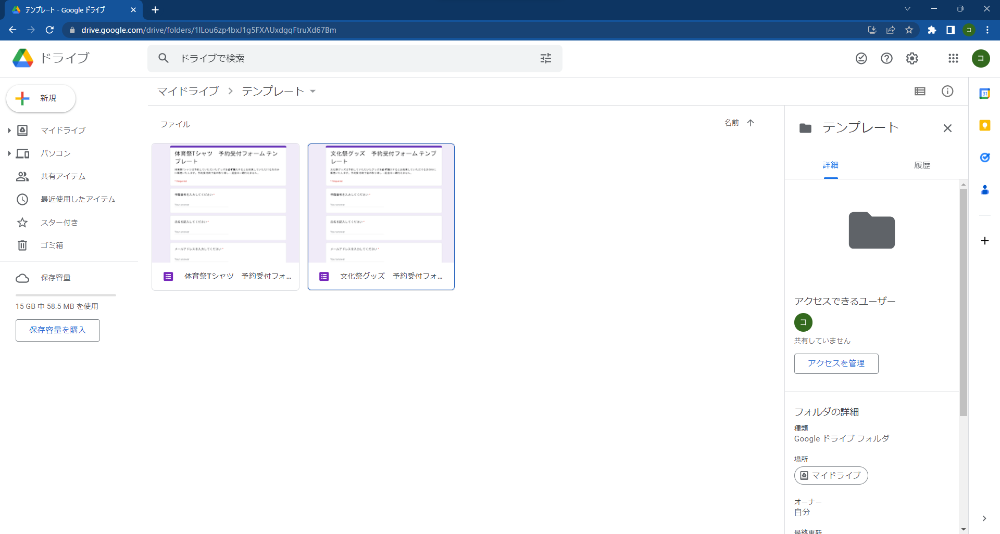

以降の操作で「文化祭」と写真に表示しているものは「体育祭」と読み替えてください。基本的な操作は同じです。
「体育祭Tシャツ」の方を右クリック→コピーします。
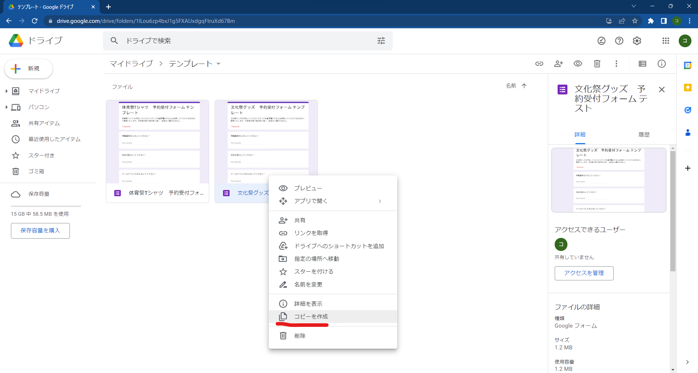

「...のコピー」と書いてあるほうを選択します。
右クリック→指定の場所に移動をクリックします。
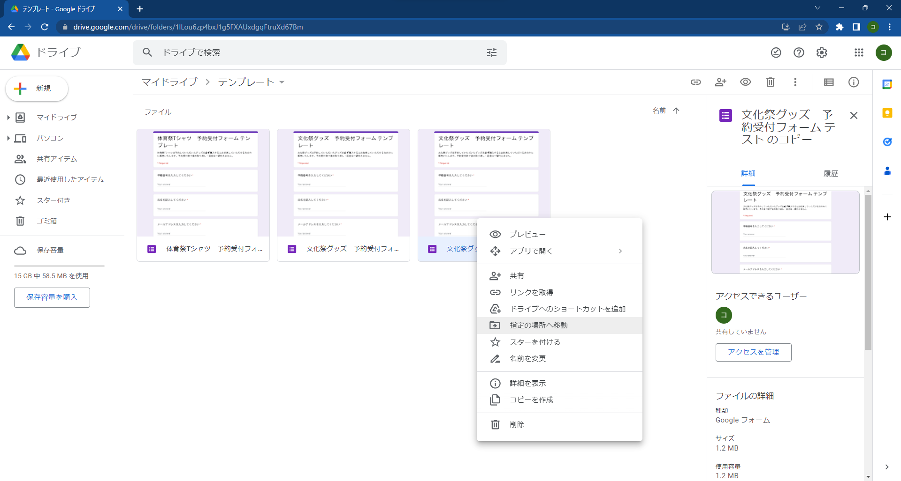
画面の指示に従って作成したフォルダまで移動します。
最後に「ここに移動」をクリックします。
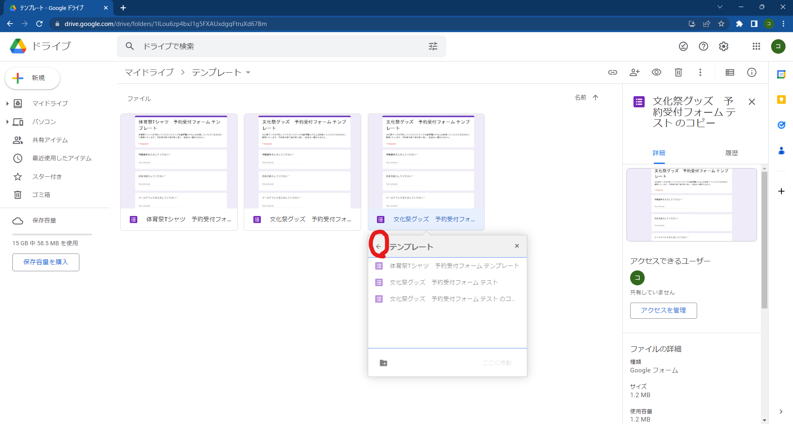
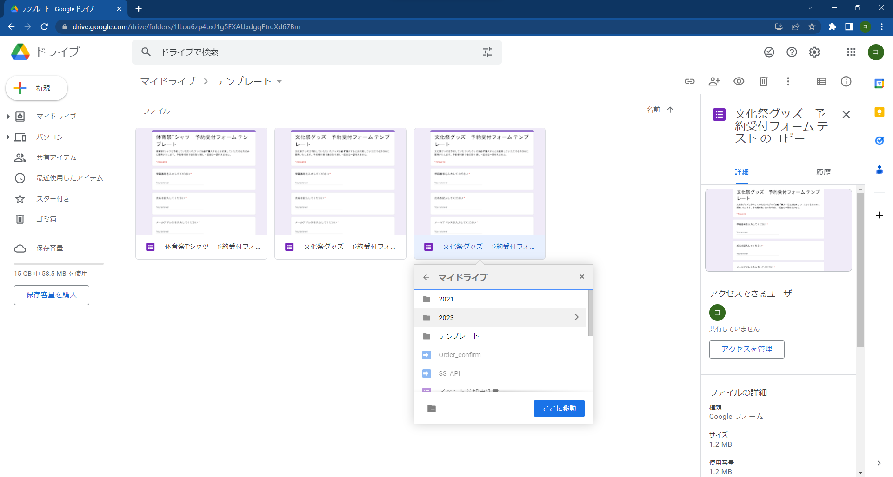
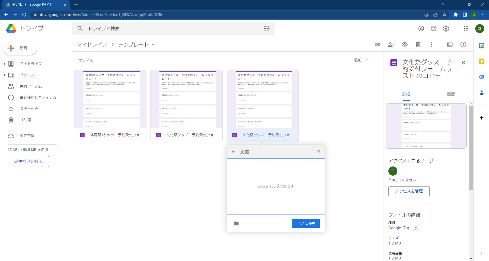

## 2.スプレッドシート作成

図の位置まで移動します。
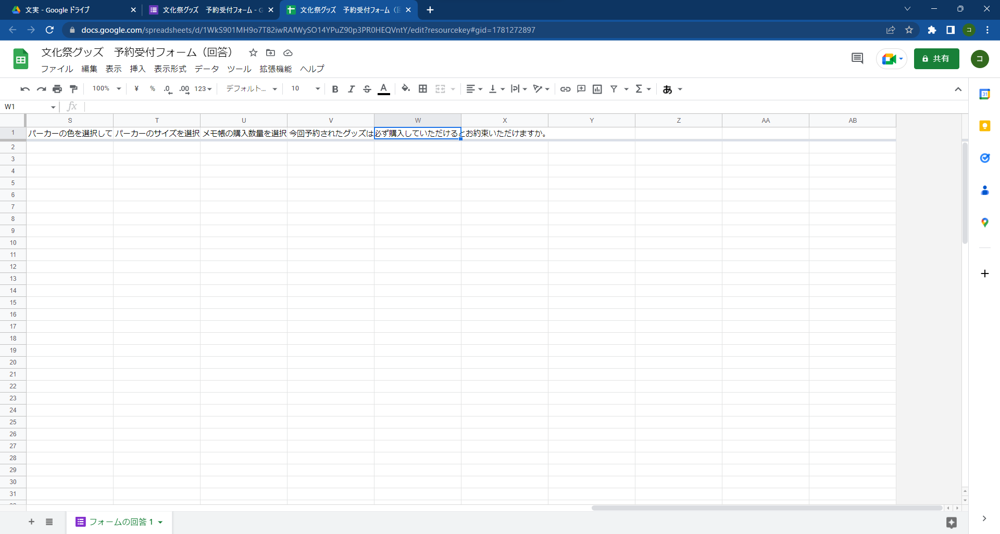
このように「注文番号」「購入済み」を追加します。
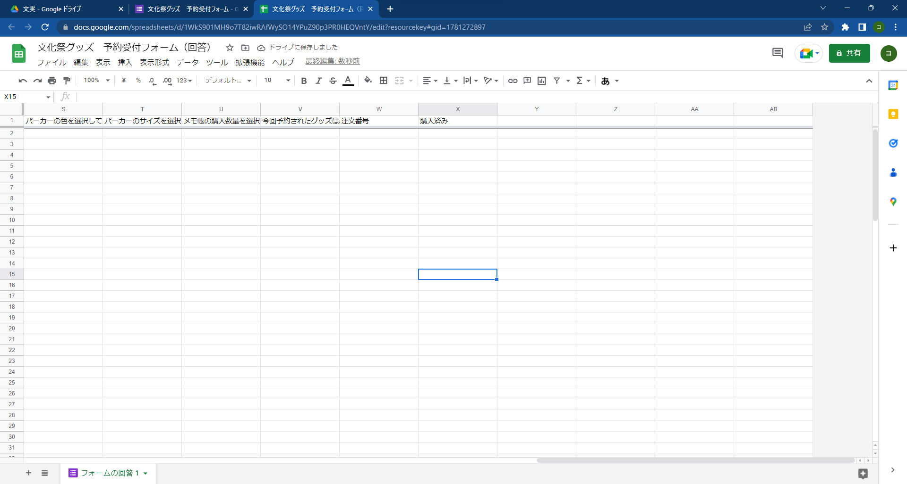

シートを追加→クリック→名前の変更の順に操作を行い、「アイテム一覧」「アイテムグループ」「プロパティ」「使用済み注文番号」のシートを作成します。
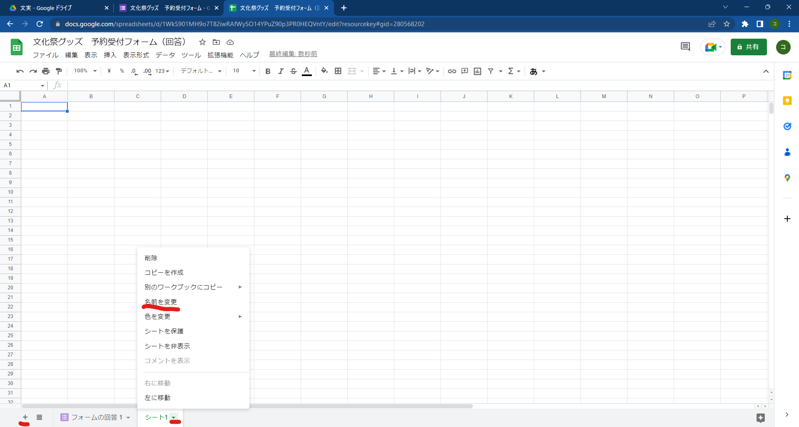

使用済み注文番号には一番上に最初の注文番号-1を入れておきます。20230000とかにしておきます。すると20230001から始まります。

そのほかのシートには次の表をコピーしてCtrl+shift+vで貼り付けます。
|                  |             |      |        |
| ---------------- | ----------- | ---- | ------ |
| アイテムグループ | アイテム名  | 値段 | サイズ |
| Tシャツ          | 白×黒       | 1000 | M      |
| Tシャツ          | 白×黒       | 1000 | L      |
| Tシャツ          | 白×黒       | 1000 | XL     |
| Tシャツ          | 黒×赤       | 1000 | M      |
| Tシャツ          | 黒×赤       | 1000 | L      |
| Tシャツ          | 黒×赤       | 1000 | XL     |
| Tシャツ          | 黄×青       | 1000 | M      |
| Tシャツ          | 黄×青       | 1000 | L      |
| Tシャツ          | 黄×青       | 1000 | XL     |
| Tシャツ          | 紫×緑       | 1000 | M      |
| Tシャツ          | 紫×緑       | 1000 | L      |
| Tシャツ          | 紫×緑       | 1000 | XL     |
| Tシャツ          | ネイビー×白 | 1000 | M      |
| Tシャツ          | ネイビー×白 | 1000 | L      |
| Tシャツ          | ネイビー×白 | 1000 | XL     |
| Tシャツ          | 緑×黄緑     | 1000 | M      |
| Tシャツ          | 緑×黄緑     | 1000 | L      |
| Tシャツ          | 緑×黄緑     | 1000 | XL     |

|                  |            |        |        |
| ---------------- | ---------- | ------ | ------ |
| アイテムグループ | アイテム名 | サイズ | タイプ |
| Tシャツ          | 5,7,9      | 6,8,10 | 名前   |

|                |     |
| -------------- | --- |
| 購入済み       | 13  |
| 注文番号       | 12  |
| 名前           | 2   |
| メールアドレス | 3   |
| 学籍番号       | 1   |
| タイムスタンプ | 0   |

解説

- アイテム一覧の表
  - アイテムグループの列はアイテムグループに登録されている名前をさします。詳しくは事項を参照してください。
  - アイテム名の列はスプレッドシートに記録される商品名です。コピーするなどしてまったく同じにしてください。少しでも違うと動きません。
  - 値段の列には値段が入っています。
    サイズの列は商品のバリエーションをさします。多くの場合でサイズをさします。何もない場合は空欄にしてください。
- アイテムグループの表
  - アイテムグループに登録する名前を入力します。任意の名前ですが、わかりやすいほうがいいでしょう。
  - アイテム名、サイズの列は、それぞれがどの列に記入されるかを入力します。一番端の列が0になります。カンマ区切りで入力してください。
  - タイプの列は、その商品がどのように記録されるかを入力します。Tシャツなどのようにアイテム名とサイズが記入されてその数を数えるものは「名前」、メモ帳のように個数が記録されるものは「個数」と書きます。
- プロパティの表
  - それぞれの設定がどの列に記入されるかです。

## 3.スクリプトの作成

フォームの画面に戻ります。
右上の3点リーダー→スクリプトエディタをクリックします。
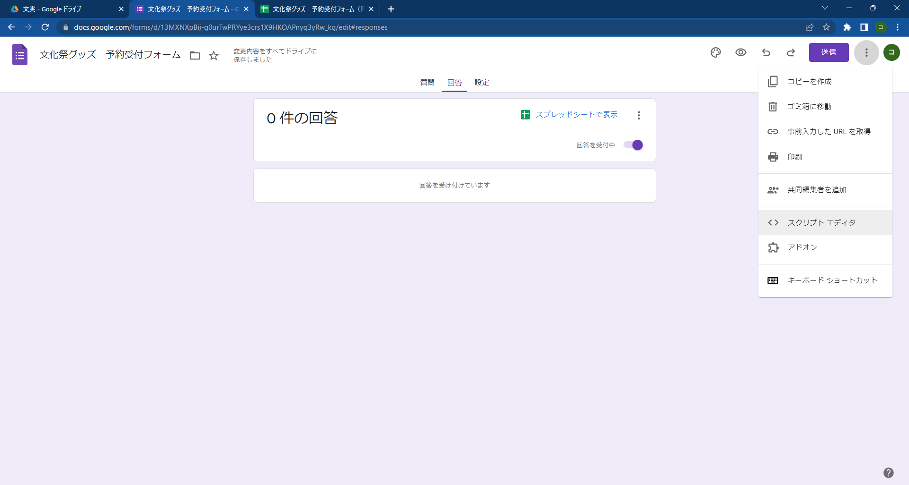

すでにテンプレがあります。
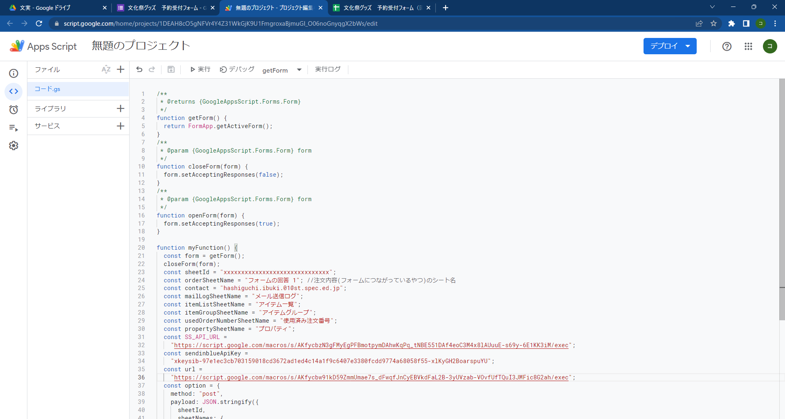

この2つを変更します。
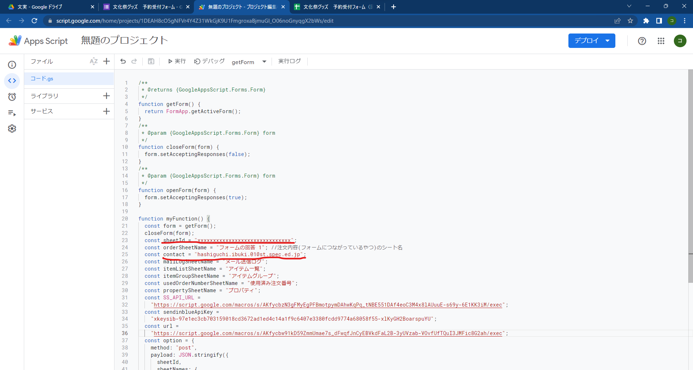
シートIDはこの部分です。
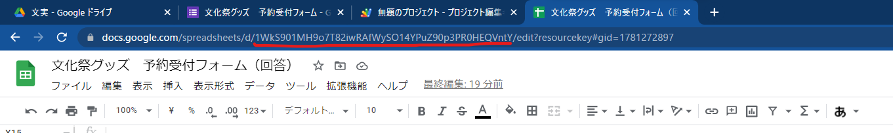
今回だと1WkS901MH9o7T82iwRAfWySO14YPuZ90p3PR0HEQVntYです。
`contact`は担当者の連絡先です。
変更後がこれです。
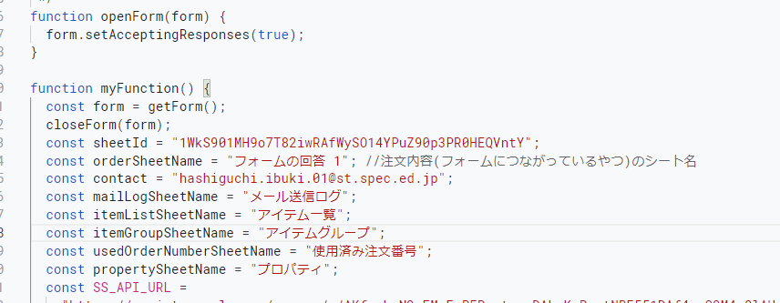

myFunctionを選択して実行を押します。
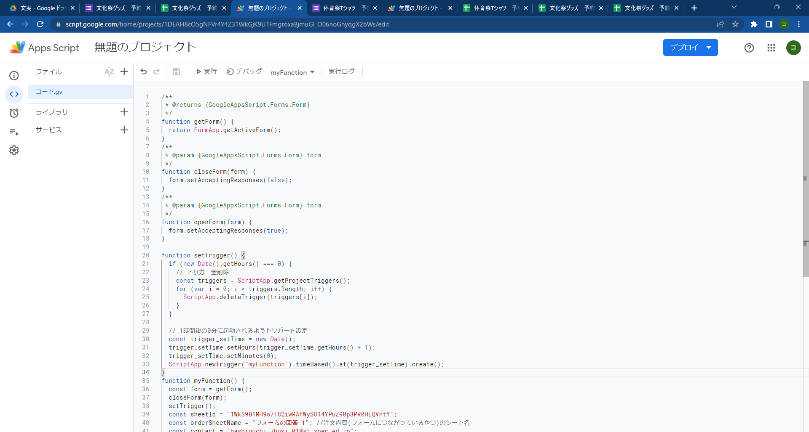
権限を確認を押します。
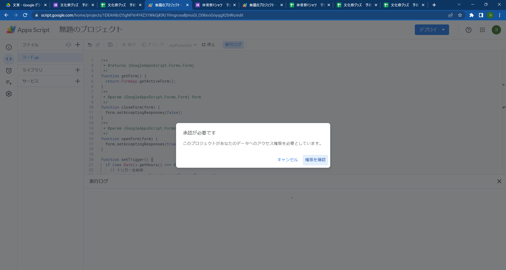
アカウント名をクリックします。
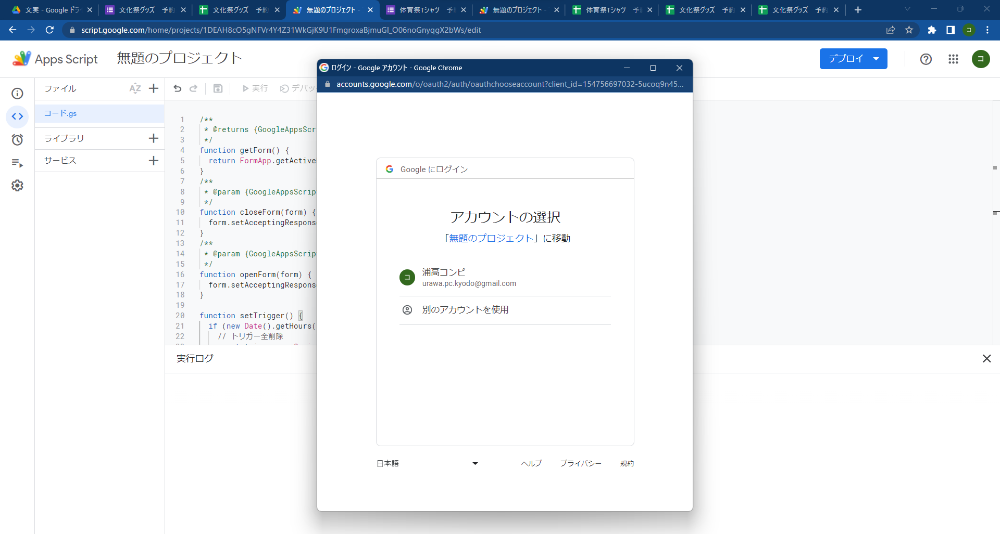
詳細をクリックします。
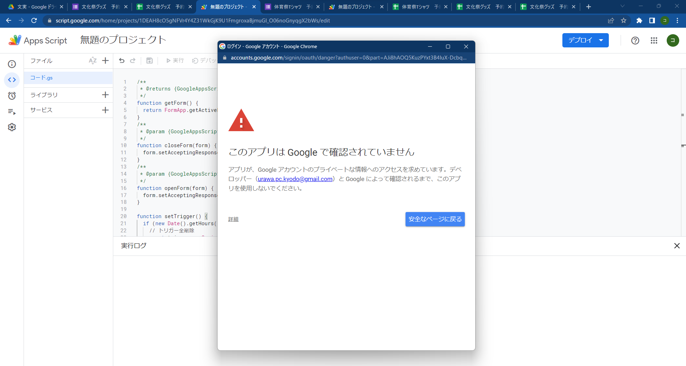
無題のプロジェクトに移動を押します。
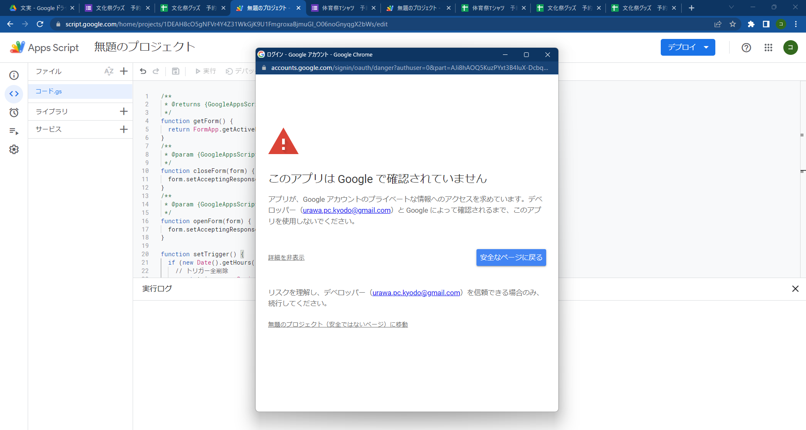
許可を押します。
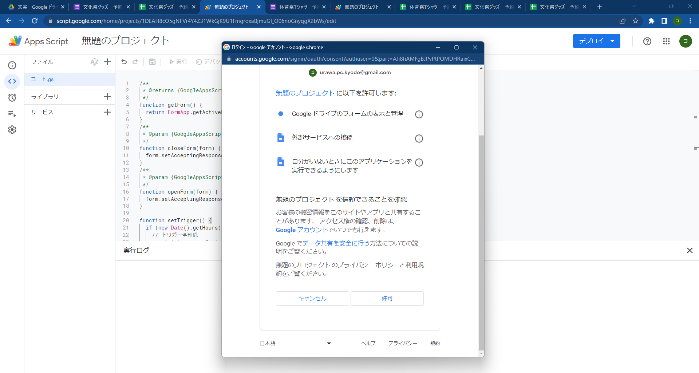

これで完成です。

注文の受付を終了したら横のトリガーから、すべてのトリガーを削除してください。

## 4.販売システムの使い方

<https://urakosai.net/sales4staff>にアクセスしてください。
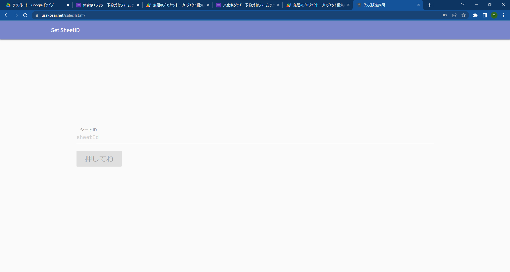

シートIDを入力します。
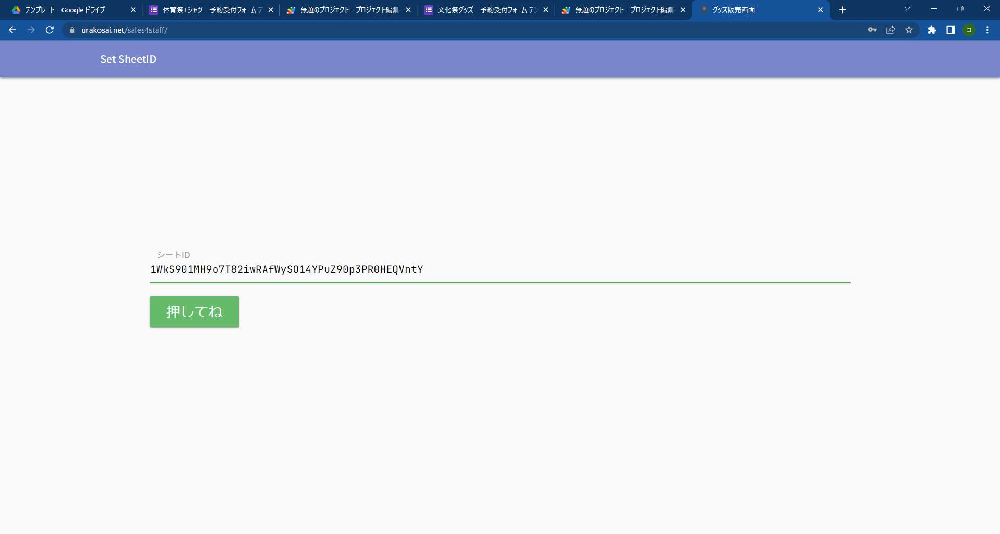
ボタンを押して次のページに進みます。
シート名を入力します。変更ないならボタンを押します。
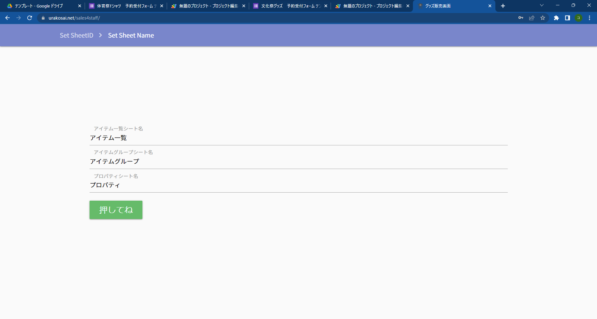
読み込みが終わると次の画面に変わります。
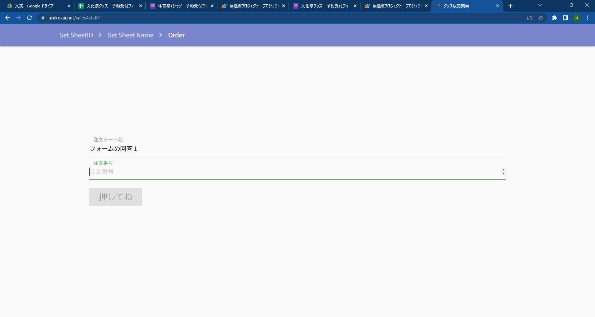
あとはQRコードを読み込むだけです。
するとこの画面が出てきます。
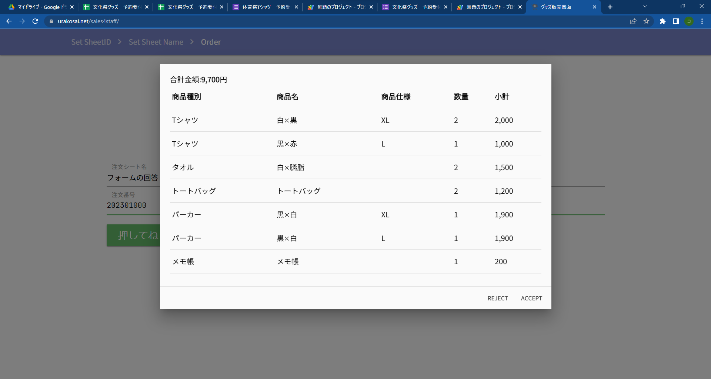
ACCEPTを押すとシートの購入済みの欄にマークがつきます。
REJECTを押すとマークがつきません。

QRコードについて

物理科に聞いた話ですが、学校にQRコードリーダーが配備されたようです。教員にいえば貸してくれるでしょう。もし普通の先生がわからないと言っても、物理科の鹿島先生や南先生に「75期の橋口の引継ぎに書いてありました」といえば多分わかってくれます。
QRコードリーダーはBluetoothの接続とレシーバーを使用した接続があります。楽なのは後者ですが、もしパソコンにUSBのポートがない場合はBluetoothで接続してください。
詳しくはQRコードリーダーについてを読んでください。

